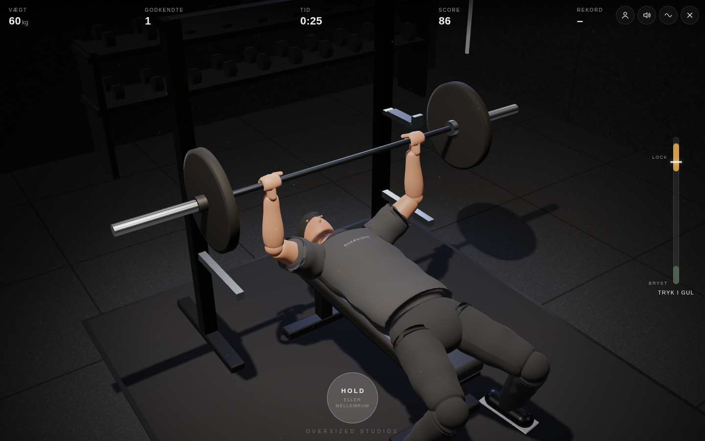
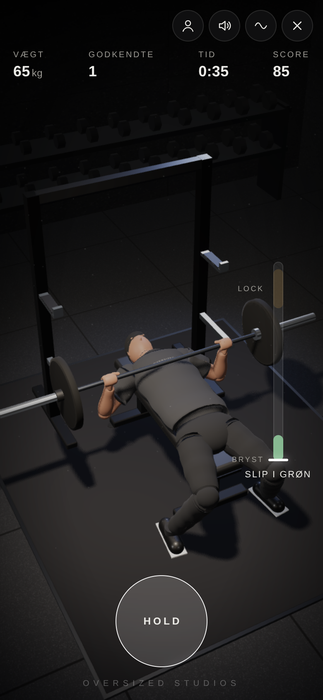
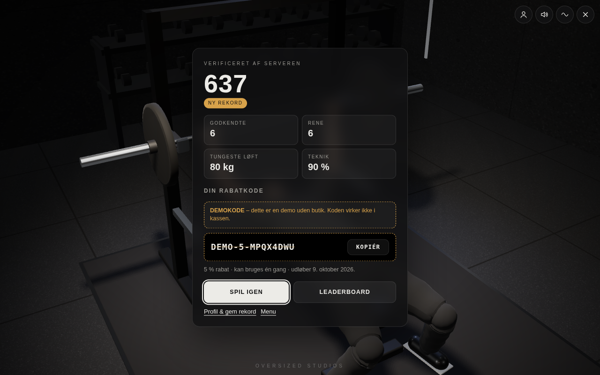

# Oversized Bench – Shopify-kampagneapp for Oversized Studios

Et 3D-bænkpresspil i et mørkt fitnesslokale. Det indlejres i butikken som en app block. Serveren genberegner hver runde ud fra spillerens input, gemmer rekorder og highscores og udsteder rabatkoder med én indløsning via Shopify Admin GraphQL API. Betalte ordrer og refunderinger registreres via webhooks.

```
oversized-campaign/
├── shared/rules.js            Spilreglerne: deterministisk simulering og scoremodel (bruges af browser OG server)
├── client/                    Browserkode (bundtes med esbuild)
│   ├── loader.js              Lille loader i app blocken – henter først spillet ved klik
│   └── game/                  Three.js-scene, atlet (IK), HUD, input, lyd, API-klient
├── src/                       Express-server
│   ├── routes/                player, rounds, leaderboard, rewards, webhooks, proxy, admin
│   └── lib/                   sessioner, spillere/sammenlægning, Shopify, rabatter, webhooks, rate limiting
├── migrations/                SQL-migrationer (køres automatisk ved start, eller med `npm run migrate`)
├── public/                    /play (demo-side), /verify (e-mail-link), /admin (indlejret administration)
├── extensions/oversized-game/ Theme App Extension (app block, loader, CSS, bundtet spil)
├── shopify.app.toml           Shopify CLI-konfiguration (scopes, webhooks, app proxy)
├── test/                      node:test – regler, API, Shopify-integration
└── scripts/                   build-extension, migrate, simulate
```

| Desktop – presset, med timingmåler | Mobil – stangen på brystet | Demokode efter bekræftelse |
|---|---|---|
|  |  |  |

Skærmbillederne er taget i headless Chromium med software-WebGL.

Stakken er den samme som i resten af repoet: Node 20+, Express 5, better-sqlite3, zod, ES-moduler og `node:test`. Three.js er brugt uden React, fordi projektet ikke bruger React.

---

## Status: hvad er verificeret – og hvad er ikke

**Verificeret her (lokalt, demotilstand og automatiske tests):**

- 52 automatiske tests (`npm test`). De dækker serverens genberegning af score, determinisme mellem browser og server, sessioner og cookieflag, dobbelt og samtidig indsendelse, for tidlig indsendelse, rate limiting, CORS/CSRF, magic link og sammenlægning af profiler, rabatudstedelse under samtidige requests og efter nedbrud, webhook-signaturer, genlevering af webhooks, refunderinger, der ankommer før ordren, app proxy-signatur og admin-sessionstokens.
- Shopify-kaldene er testet mod en **falsk** Shopify, som svarer med samme format som den rigtige: token exchange, `discountCodeBasicCreate`, `codeDiscountNodeByCode` og webhook-payloads.
- Hele runder spillet i headless Chromium (software-WebGL) i desktop- (1280×800, 1440×900) og mobilstørrelse (390×844, touch). Den lokale score i browseren var identisk med serverens genberegnede score i alle kørsler.

**Ikke verificeret (kræver en rigtig butik og credentials, som ikke var tilgængelige):**

- Installation i en rigtig Shopify-butik, token exchange mod Shopify, oprettelse af rigtige rabatkoder og rigtige webhook-leveringer.
- At genkendelsen virker i en rigtig storefront på et rigtigt domæne (se "Cookies"). Designet følger Shopifys og browsernes regler, men det er ikke afprøvet live.
- At `import()` af spilfilen fra Shopifys CDN (theme extension assets) virker i alle browsere. Det kræver CORS-headere fra CDN'et. Tjek det ved første deploy. Loaderen viser en fejlbesked, hvis det fejler.
- Rigtige telefoner. Mobilvisningen er testet med emulering. Test på en nyere iPhone (Safari) og en Android-telefon (Chrome) før lancering.
- GLB-adapteren til en rigget atlet (`client/game/glbAthlete.js`) er skrevet, men ikke afprøvet med en rigtig model.

---

## Lokal opstart (demotilstand – ingen Shopify-nøgler)

```bash
cd oversized-campaign
npm install
npm start               # bygger spillet og starter på http://localhost:4000
```

- Spil: <http://localhost:4000/play>. Siden viser samme app block som butikken.
- Administration: <http://localhost:4000/admin>. Uden Shopify er det en demo-admin, som kun kan åbnes fra den lokale maskine.
- E-mail-links skrives i terminalen og vises i spillet, tydeligt mærket "DEMO".
- Rabatkoder starter med `DEMO-` og vises overstregede med teksten "DEMOKODE – virker ikke i kassen". Der oprettes intet i nogen butik.

Demotilstanden er slået til, når `SHOPIFY_API_KEY`, `SHOPIFY_API_SECRET` eller `SHOPIFY_SHOP_DOMAIN` mangler. Den nægter at starte med `NODE_ENV=production`, medmindre `ALLOW_DEMO_IN_PRODUCTION=1` er sat.

Nyttige kommandoer:

```bash
npm test                # alle tests
npm run dev             # bygger og genstarter serveren ved ændringer
npm run build           # bygger kun app block-assets (loader + spil)
npm run simulate        # spiller 1.500 runder med bots og viser scorefordelingen
npm run migrate         # kører databasemigrationer
```

---

## Spillet

En runde varer 45 sekunder. Spilleren bruger én knap: mellemrumstasten eller en stor touchknap. På touch kan man også holde fingeren hvor som helst på scenen.

1. **Hold nede**, og stangen sænkes kontrolleret mod brystet.
2. **Slip** i den grønne zone (stangen rører brystet), så starter presset. Slipper man for højt, bliver det en halv eller ingen gentagelse. Holder man for længe på brystet, mister man spændingen – og til sidst synker stangen, og spotteren tager den.
3. **Tryk igen**, når markøren passerer den gule lockout-zone. Et tryk midt i zonen giver den bedste kvalitet. Trykker man for tidligt eller for sent, falder kvaliteten, eller gentagelsen dumper.

Gode gentagelser får vægten til at stige med 2,5–5 kg. Trætheden stiger for hver gentagelse. Det gør sænkningen og presset langsommere, zonerne smallere og "sticking point" tungere. Visuelt ses det som rystelser i stang og arme, hurtigere og tungere vejrtrækning, rødme i ansigtet, et lille kameraskub ved fejl og lyde, der følger belastningen.

HUD'en viser vægt, godkendte gentagelser, tid, score og rekord. Timingmåleren er en smal lodret skala ved siden af scenen, der viser stangens højde med den grønne brystzone og den gule lockout-zone. Teknikfeedback vises kort midt på skærmen og læses op af skærmlæsere (aria-live).

Der er også en interaktiv introduktion i tre trin med en øvestang, der ikke tæller, samt knapper til lyd til/fra og reduceret bevægelse. Reduceret bevægelse følger `prefers-reduced-motion` som standard og fjerner kameradrift, rystelser og animationer.

### Scoremodel (deterministisk)

Alle regler ligger i `shared/rules.js` (`RULES_VERSION = 1`) og kører **ens i browser og på server**. Der bruges kun heltalstider (ms fra rundens start), `+ − × ÷` og afrunding. Der bruges ingen `sin`, `exp` eller `pow`, fordi de kan give forskellige sidste decimaler i forskellige JavaScript-motorer. Tilfældighed kommer fra rundens seed (mulberry32).

For hver gentagelse:

- `dybde` ∈ [0, 1]: 1 ved berøring af brystet inden for 350 ms. Den falder, jo højere man slipper, eller jo længere man hviler på brystet.
- `lockout` ∈ [0, 1]: 1 midt i den gule zone og 0,5 ved zonens kant. Et tidligt eller sent tryk giver 0,25–0,5. Alt for tidligt eller intet tryk giver en dumpet gentagelse.
- `kvalitet = 0,45 × dybde + 0,55 × lockout` (afrundet til 3 decimaler).
- Godkendt gentagelse: `point = round(kg × 1,5 × kvalitet × (1 + 0,08 × min(rene i træk, 6)))`. En gentagelse er "ren", når kvalitet ≥ 0,85.
- Rundens score er summen af point for godkendte gentagelser. Gentagelser, der ikke er færdige, når tiden løber ud, tæller ikke.

`npm run simulate` viser fordelingen med bots: perfekt ≈ 2.400, dygtig ≈ 1.700, middel ≈ 1.200 og sjusket ≈ 950. Rigtige mennesker scorer lavere end botterne. Juster demoniveauerne efter de første dages data.

Ændrer I tal i reglerne, **skal `RULES_VERSION` hæves**. Gamle klienter bliver så afvist med en besked om at genindlæse siden.

---

## Genkendelse uden password

- Første gang man spiller, oprettes en **anonym spillerprofil**. Browseren får et tilfældigt token på 32 bytes i en cookie: `__Host-osg_sid` (produktion) med `HttpOnly; Secure; SameSite=Lax; Path=/`. Levetiden er 180 dage og forlænges løbende. Databasen gemmer kun SHA-256 af tokenet.
- Score, rekord og rabatberettigelse ligger **kun i databasen**. Browseren gemmer kun to præferencer i `localStorage`: lyd og reduceret bevægelse.
- Brugerfladen siger tydeligt, at rekorden genkendes i denne browser og ikke automatisk følger med til andre enheder.
- **Frivillig tilknytning af e-mail:** spilleren indtaster en e-mail og får et engangslink, der udløber efter 20 minutter. Tokenet står i URL-fragmentet, som aldrig sendes til serveren, og bruges først, når man trykker "Bekræft". Derfor kan mailklienters link-scannere ikke bruge linket op.
  Bekræftelsen gælder **den browser, der åbner linket** – ikke den, der bad om det. Ellers kunne en angriber bede om et link til en andens adresse og få sin egen browser knyttet til ejerens profil, hvis ejeren klikkede. Ejer en anden profil allerede den bekræftede e-mail, lægges browserens profil sammen med den: runder, rekord, alias og belønninger flyttes til den profil, der ejer e-mailen. Profiler lægges **kun sammen efter verificeret ejerskab**. En indtastet e-mail alene ændrer intet (det er testet, også angrebsscenariet).
- **Shopify-kundelogin (valgfrit):** er kunden logget ind i butikken, kan spilleren trykke "Brug min kundekonto". Storefronten henter så `/apps/oversized/customer-assertion` via Shopifys app proxy. Shopify signerer `logged_in_customer_id`, og serveren verificerer signaturen og udsteder en kortlivet engangserklæring (2 minutter). Spillet sender den videre til API'et, som knytter kunde-ID'et til profilen.
- Der bruges ingen fingerprinting og ingen tracking. Funktionel genkendelse (den nødvendige cookie) er adskilt fra markedsføring. Samtykke til nyhedsbrev er et separat, frivilligt flueben, som kræver bekræftet e-mail og gemmes med tidspunkt.

### Cookies i en rigtig Shopify-storefront

Det er det vigtigste driftsvalg, så læs det:

1. **Shopifys app proxy fjerner cookies.** Shopify fjerner `Cookie`-headeren fra forespørgsler og `Set-Cookie` fra svar på `/apps/...`. En HttpOnly-sessionscookie kan derfor ikke gå gennem app proxyen. Proxyen bruges kun til Shopifys signerede kundelogin.
2. **En cookie fra et fremmed domæne er en tredjepartscookie.** Safari blokerer dem, og andre browsere er på vej. Derfor må API'et ikke ligge på fx `oversized-bench.fly.dev`.
3. **Løsning: læg serveren på et underdomæne af butikkens eget domæne**, fx `play.oversizedstudios.com`, når butikken ligger på `www.oversizedstudios.com`. Samme *site* betyder, at cookien er førstepartscookie (`SameSite=Lax`) og sendes med `fetch(..., { credentials: 'include' })` fra storefronten. Serveren svarer med CORS for de origins, der står i `STOREFRONT_ORIGINS`.
4. **Safari ITP:** peger underdomænet via CNAME på en host med en helt anden IP end butikken, kan Safari begrænse cookies sat af serveren til 7 dage. Cookien forlænges ved hvert besøg, så aktive spillere mærker det ikke, men en spiller, der er væk i mere end 7 dage i Safari, kan blive "ny". E-mail-tilknytning løser det.
5. **Fallback:** hvis browseren alligevel afviser cookien (fx en butik uden eget domæne på `*.myshopify.com`), opdager spillet det og bruger et kortlivet token, der kun ligger i sidens hukommelse (4 timer, aldrig i storage). Man kan spille, men man bliver ikke genkendt næste gang. Brugerfladen siger det.

---

## Server og snydebeskyttelse

- `POST /api/rounds` opretter en runde med ID, seed (32 bit, kryptografisk tilfældigt), udløbstid (45 s + 60 s) og regelversion. Starter man en ny runde, opgives den forrige: én aktiv runde pr. spiller og højst 6 åbne runder pr. IP.
- `POST /api/rounds/:id/submit` modtager **kun inputhændelser** `[[ms, 1|0], …]`. Serveren
  - afviser alt andet end skiftevis tryk og slip, tider uden for 0–45.000 ms, faldende tider, mindre end 25 ms mellem hændelser og mere end 600 hændelser,
  - afviser en runde, der indsendes før 45 s kan være gået på serverens ur (minus 1,5 s tolerance), eller som har hændelser senere end den reelle tid,
  - genberegner scoren med `shared/rules.js`. En eventuel score eller et rabatniveau fra klienten ignoreres (det er testet),
  - gør indsendelsen atomisk: samme hændelser sendt igen giver det gemte resultat, mens andre hændelser giver 409. Samtidige indsendelser tælles kun én gang,
  - markerer mistænkelige runder (næsten perfekt timing, robotagtigt ens holdetider) til administrationen. Markeringen ændrer ikke scoren.
- Rate limiting: API generelt 240/min pr. IP, runder 15/10 min pr. spiller og 40 pr. IP, e-mail-links 3/time pr. spiller og pr. adresse samt 10 pr. IP, og indløsning af belønning 10/10 min.

**Begrænsning:** servervalideringen gør det meget svært at indsende en opdigtet score, fordi man skal spille runden. Men den **kan ikke stoppe en bot**, der styrer browseren og trykker på det rigtige tidspunkt. Alle regler og seeds findes nødvendigvis i klienten. Med kravet om bekræftet identitet kan én bot højst hente én kode pr. e-mailadresse eller kundekonto.

---

## Highscores og leaderboard

Personlig rekord og spilhistorik (`GET /api/rounds/history`) gemmes i databasen. Leaderboardet viser top 20 og **kun** spillere, der selv har valgt et alias og slået "vis mig" til. E-mail, kunde-ID og interne ID'er vises aldrig. Aliasser er unikke (uanset store og små bogstaver) og tegnbegrænsede, og staff kan skjule et alias i administrationen. Leaderboardet slås til og fra under Kampagne.

---

## Rabatkoder

- Rabatniveauer er **demoindstillinger**, indtil butikken ændrer dem: 500 point → 5 %, 1.000 → 10 % og 2.000 → 15 %. Brugerfladen og administrationen viser "Demoniveauer", så længe de står uændret.
- Klienten beder kun om at hente sin rabat. **Serveren** vælger niveauet ud fra spillerens bedste verificerede runde i kampagneperioden.
- Koden oprettes med `discountCodeBasicCreate` (Admin GraphQL API 2026-07) med:
  - `usageLimit: 1` (én indløsning i alt) og `appliesOncePerCustomer: true`,
  - `startsAt`/`endsAt` (udløb efter `codeValidDays`),
  - `minimumRequirement.subtotal`, hvis der er et minimumskøb,
  - `customerGets.items` begrænset til produkter og/eller kollektioner, hvis det er valgt,
  - `combinesWith` (ordre-, produkt- og fragtrabatter),
  - `context: { customers: { add: [kunde] } }`, når spilleren er logget ind som kunde og kampagnen binder koden til kunden. Ellers `context: { all: ALL }`.
- **Idempotens:** tabellen `rewards` har unikke nøgler på (kampagne, spiller) og (kampagne, verificeret identitet). Rækken og den endelige kode skrives *før* Shopify kaldes, og en lås på 30 sekunder forhindrer to samtidige kald. Fejler kaldet efter, at Shopify faktisk har oprettet koden, finder næste forsøg koden med `codeDiscountNodeByCode` i stedet for at oprette en ny. Fem samtidige requests giver ét Shopify-kald (det er testet).
- **Én belønning pr. kunde** kræver verificeret identitet (`requireVerified`, slået til som standard): bekræftet e-mail eller Shopify-kundelogin. Anonyme spillere kan spille, men får ikke en rigtig kode. **Cookies alene kan ikke håndhæve én belønning pr. person.** Man kan altid rydde cookies, bruge privat vindue eller en anden enhed. Slås kravet fra, er grænsen kun én kode pr. browserprofil.

---

## Ordrer og webhooks

Abonnementer i `shopify.app.toml` (API-version 2026-07): `orders/paid`, `refunds/create`, `app/uninstalled` og de obligatoriske compliance-emner `customers/data_request`, `customers/redact` og `shop/redact`. Alle leveres til `POST /webhooks`.

- **Signatur:** `X-Shopify-Hmac-Sha256` verificeres mod de **rå bytes** af request body med appens client secret, med konstant-tids sammenligning. Webhook-ruten er monteret før JSON-parseren.
- **Genlevering:** `X-Shopify-Event-Id` gemmes i samme transaktion som effekten. En gentaget levering bliver derfor ikke behandlet igen. Fejler behandlingen, rulles alt tilbage, fejlen logges som integrationsfejl, og der svares 500, så Shopify prøver igen.
- **Forkert rækkefølge:** ordredetaljer overskrives kun af et nyere `updated_at`. Refunderinger gemmes for sig og kobles til ordren via ordre-ID, så en refundering, der ankommer før `orders/paid`, bliver vist korrekt (det er testet).
- **Kobling til belønning:** koden i `discount_codes` på den betalte ordre (uden hensyn til store og små bogstaver) kobles til den udstedte belønning, og ordre-ID og `admin_graphql_api_id` gemmes. Spillerens cookie bruges ikke – den findes ikke i checkout.
- En refundering registreres særskilt og **gør aldrig en brugt kode gyldig igen**.
- `customers/redact` anonymiserer spilleren (e-mail, kunde-ID og alias). `shop/redact` sletter ordre-, indløsnings- og refunderingsdata samt butikkens token. `customers/data_request` vises som en opgave under Integrationsfejl.

---

## Administration

Administrationen åbnes inde i Shopify admin som indlejret app med App Bridge. Hvert kald bærer App Bridges sessionstoken (JWT, HS256), og serveren verificerer signatur, `aud` (API-nøglen), `dest` (butikken), `exp` og `nbf`. Første gang bytter serveren sessionstokenet til et **udløbende offline Admin API-token med refresh token** (token exchange), som gemmes AES-256-GCM-krypteret. `frame-ancestors` tillader kun butikken og `admin.shopify.com`.

Faner:

- **Oversigt:** nøgletal.
- **Kampagne:** aktiv/inaktiv, periode, scoregrænser og rabatsatser, kodepræfiks, gyldighed, minimumskøb, produkter/kollektioner, kombination, krav om verificeret identitet, kundebinding og leaderboard.
- **Belønninger:** udstedt, indløst (ordre, beløb) og refunderet (særskilt), med "Prøv igen" ved fejl.
- **Runder:** godkendte, afviste og markerede.
- **Spillere:** maskeret e-mail, samt skjul/vis alias.
- **Integrationsfejl:** Shopify, mail, webhooks og compliance.

---

## Mobil og performance

- App blocken indlæser kun en loader på ca. 2 kB og en CSS-fil. Spillet (three.js og spilkode, ca. 640 kB minificeret) hentes **først, når der trykkes "Spil nu"**. På desktop prefetches det ved hover eller fokus. GLB-loaderen ligger i sin egen chunk og hentes kun, hvis en model er sat.
- Grafikniveauet vælges ud fra enheden:
  - lav: pixelratio 1 og skygger på 512 px,
  - mellem (touch og små skærme): pixelratio ≤ 1,5 og skygger på 1.024 px,
  - høj: pixelratio ≤ 2 og skygger på 2.048 px.
  Kører spillet under ca. 45 fps i 3 sekunder, sænkes niveauet automatisk. `?osgQuality=low|medium|high` tvinger et niveau (til test).
- Mangler WebGL, eller mister spillet grafikkonteksten, vises en forståelig besked i stedet for en tom skærm. Rendering pauser, når fanen er skjult.
- Spillet kører i en shadow root, så temaets CSS ikke påvirker det. Overlayet bruger `100%` plus `env(safe-area-inset-*)`, og touchknappen er mindst 104 px.

---

## Installation i Shopify

Du skal bruge [Shopify CLI](https://shopify.dev/docs/api/shopify-cli), en app i Dev Dashboard eller Partner Dashboard og en server med HTTPS på et underdomæne af butikkens domæne.

1. **Opret appen**, og notér client ID og client secret.
2. **Ret `shopify.app.toml`:** `client_id`, og erstat `play.oversizedstudios.com` med jeres host overalt.
3. **Scopes:** `write_discounts` (opret rabatkoder) og `read_orders` (ordre- og refunderingswebhooks). Der bruges ikke andre.
4. **Beskyttede kundedata:** ordrewebhooks indeholder kundedata. I Partner Dashboard → App → API access skal I anmode om adgang til *protected customer data* (niveau 1) og beskrive formålet (kobling af rabatkoder til ordrer).
5. **Byg og deploy** app-konfiguration og theme app extension:
   ```bash
   npm run build            # skriver extensions/oversized-game/assets/oversized-*.js
   shopify app deploy       # konfiguration (scopes, webhooks, app proxy) + extension
   ```
6. **Installer appen** i butikken, og åbn den én gang fra Shopify admin. Så henter serveren sit Admin API-token via token exchange. Status øverst i administrationen viser "Admin API klar".
7. **Tilføj blocken:** Online Store → Themes → Customize → vælg en side (fx en kampagneside) → Add block → Apps → **Oversized Bench**. Sæt "Spilserverens adresse" til jeres host.
8. **Tjek i en rigtig browser:** åbn siden i Safari og Chrome, spil en runde, genindlæs, og kontrollér, at rekorden er genkendt. Test også "Brug min kundekonto", mens du er logget ind som kunde.

## Deployment

- Kør `npm ci && npm start` (`prestart` bygger spillet) bag en reverse proxy med TLS på `play.<butikkens domæne>`. Sæt `TRUST_PROXY` til antallet af proxy-hop, så rate limiting ser den rigtige IP.
- Påkrævet i produktion: `APP_SECRET` (32+ tilfældige bytes), `APP_URL` (https), `STOREFRONT_ORIGINS`, `SHOPIFY_API_KEY`, `SHOPIFY_API_SECRET`, `SHOPIFY_SHOP_DOMAIN` og `SMTP_URL` (ellers kan e-mail ikke bruges til gendannelse og verifikation).
- SQLite (WAL) på et **persistent volume**, med backup af `data/campaign.sqlite`. Løsningen er beregnet til **én instans**: rate limiting ligger i hukommelsen, og SQLite serialiserer skrivninger, hvilket er det, der gør udstedelsen atomisk. Skal der køre flere instanser, skal rate limiting flyttes til Redis eller databasen og databasen til Postgres. De unikke indeks og "claim"-mønstret virker uændret dér.
- Migrationer ligger i `migrations/NNN_navn.sql` og køres automatisk ved start. Rør aldrig en migration, der er kørt i produktion – lav en ny.

## Udskift atleten med en rigget GLB-model

Den nuværende atlet er et **midlertidigt asset** bygget i kode (se `LICENSES.md`). Sådan indsætter du en rigtig model:

1. Find en licenseret, rigget model (fx eksporteret fra Mixamo, Character Creator eller lavet på bestilling) med Mixamo-knoglenavne. Ellers skal `MIXAMO_BONES` i `client/game/glbAthlete.js` tilpasses. Tjek, at licensen tillader kommerciel webbrug.
2. Klæd modellen i oversized t-shirt og joggers, og hold den under ca. 3 MB (Draco/meshopt-komprimering).
3. Upload GLB'en til `extensions/oversized-game/assets/` eller Shopify Files, og sæt URL'en i blockens felt "Rigget atletmodel".
4. Justér `rootTransform` (position, rotation, skala), så modellen ligger på ryggen med hovedet mod −X. Arme og ben styres derefter af den samme IK som i dag, så hænderne følger stangen.

Adapteren er ikke afprøvet med en rigtig model endnu. Fejler indlæsningen, bruges den indbyggede atlet, og der skrives en advarsel i konsollen.

---

## Det mangler for at gå live

| Mangler | Hvem | Hvor |
|---|---|---|
| Client ID og client secret fra Shopify | Butikken | `.env`, `shopify.app.toml` |
| Butikkens myshopify-domæne | Butikken | `SHOPIFY_SHOP_DOMAIN` |
| Underdomæne med TLS, fx `play.oversizedstudios.com`, og hosting med persistent disk | Butikken / drift | DNS, hosting, `APP_URL` |
| SMTP-konto til engangslinks | Butikken | `SMTP_URL`, `MAIL_FROM` |
| Godkendelse af protected customer data | Butikken i Partner Dashboard | App → API access |
| Endelige rabatniveauer, periode og regler | Butikken | Administration → Kampagne |
| (Valgfrit) licenseret, rigget atletmodel | Butikken / 3D-leverandør | Blockens indstilling + `LICENSES.md` |
| Live-test på rigtige telefoner og i rigtig storefront | Butikken | Se "Status" øverst |

Privatlivspolitikken skal nævne den nødvendige cookie (genkendelse af spilprofil), e-mail til gendannelse og frivilligt nyhedsbrev.
